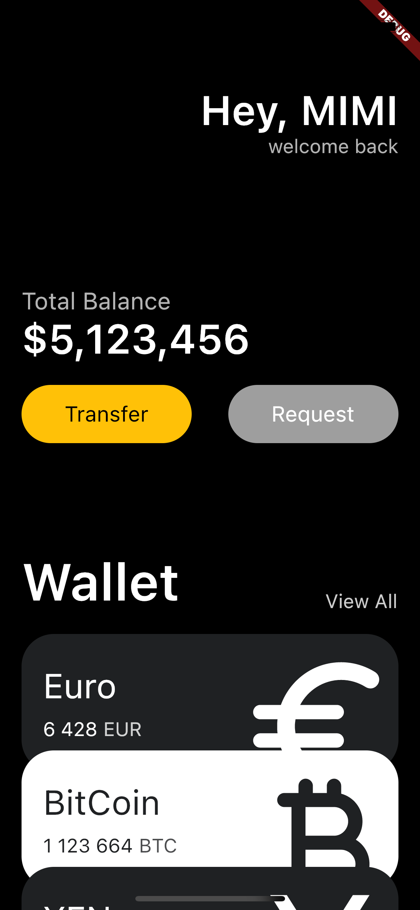

### MAC OS Flutter 설치
1. Homebrew이용  
    아래 커맨드 순차적으로 실행  
    brew install --cask android-studio  
    brew install --cask android-SDK  
    brew install --cask android-ndk  
    brew install --cask flutter  
    
2. bash_profile 수정  
    vim ~/.bash_profile  
    export PATH="`pwd`/flutter/bin:$PATH"  

### Flutter Project 생성
1. 터미널 열기
2. 프로젝트 생성하려는 경로가기  
    ex> cd Documents/  
3. 프로젝트 만들기  
    ex> flutter create my_app
4. 생성된 프로젝트로 이동  
    ex> cd my_app/  
5. VSCode로 열기  
    ex> code .

 
---

### Code Actions
VSCode > 왼쪽 manag버튼 > Commnand Palette > Open User Setting(JSON) 열기 > 아래설정 추가하기
~~~ json
"editor.codeActionsOnSave": {
    "source.fixAll": true
},
"dart.previewFlutterUiGuides": true,
~~~
- source.fixAll 저장시 자동으로 const를 붙여준다  
- previewFlutterUiGuides : 들여쓰기의 안내선을 표시해준다(VSCode 재시작시 적용됨)  

 

### 완성화면

